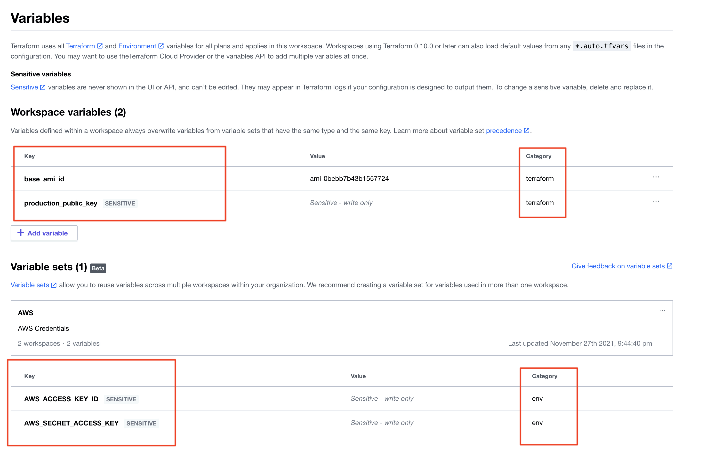

## Setup

⚠️ _Do not follow these instructions blindly. Please take the time to review the steps and adapt them to your environment._

### 0. Pre-requisites

- [aws-cli](https://aws.amazon.com/cli/)
- [Terraform 0.15.x+](https://www.terraform.io/)
- [Packer](https://www.packer.io/)
- [Node.js 14.x](https://nodejs.org/en/)

Clone this repository and follow the instructions below:

### 1. Build the AWS EC2 AMI

```sh
cd infra/images
packer build .
```

Once the AMI has been built you should be able to see in your AWS console as such:


### 2. Create a RSA keys to use for accessing the instances

You need to create 2 keys, 1 for staging and 1 for production with this command (feel free to change the file names):

```sh
# Create a key pair for the staging environment
ssh-keygen -t rsa -b 4096 -C "ubuntu@staging" -f ~/.ssh/id_staging_cicd

# Create a key pair for the production environment
ssh-keygen -t rsa -b 4096 -C "ubuntu@production"  -f ~/.ssh/id_prod_cicd
```

### 3. Add variables to Terraform Cloud

1. Add 4 variables to Terraform Cloud. Feel free to create variable sets and assign them. The variables are:

   

1. Edit your `main.tf` file and update the `backend` `organization name` and `workspaces` to match your Terraform Cloud organization and workspace:

   ```hcl
   terraform {
      backend "remote" {
         organization = "<YOUR_ORG_NAME>"

         workspaces {
            name = "<YOUR_WORKSPACE_NAME>"
         }
      }
   ```

### 4. Spin up your EC2 instances from the AMI we built

```sh
$ cd infra/instances/production

$ terraform init
$ terraform plan
$ terraform apply

aws_key_pair.production_key: Creating...
aws_key_pair.production_key: Creation complete after 0s [id=production-key]
aws_instance.production_cicd_demo: Creating...
aws_instance.production_cicd_demo: Still creating... [10s elapsed]
aws_instance.production_cicd_demo: Still creating... [20s elapsed]
aws_instance.production_cicd_demo: Still creating... [30s elapsed]
aws_instance.production_cicd_demo: Creation complete after 36s [id=i-0d64f917b9c87b37a]

Apply complete! Resources: 2 added, 0 changed, 0 destroyed.

Outputs:

production_dns = "ec2-----redacted------.eu-west-1.compute.amazonaws.com"
```

If all goes well, you should see your instances in the console as such:


Do the same for your staging environment.
